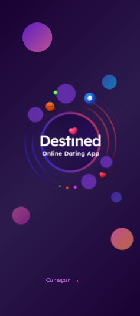
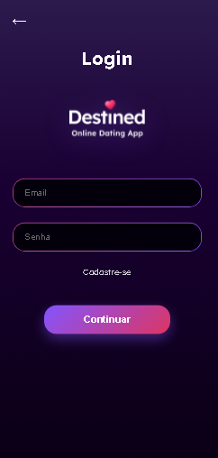
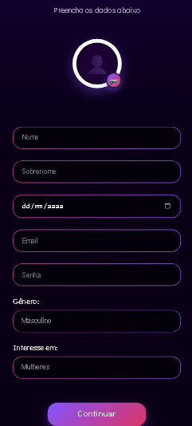
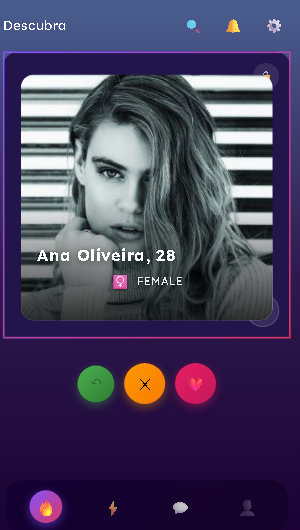
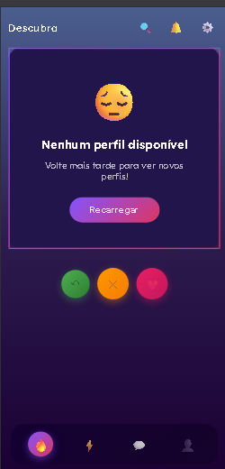
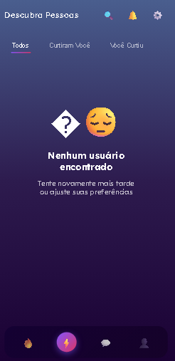
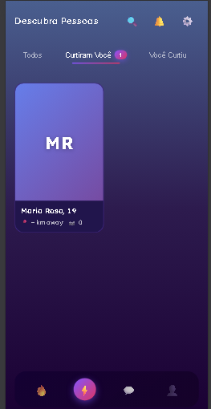
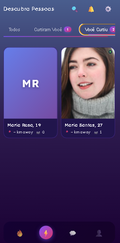
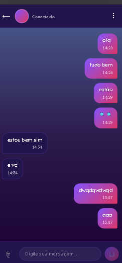
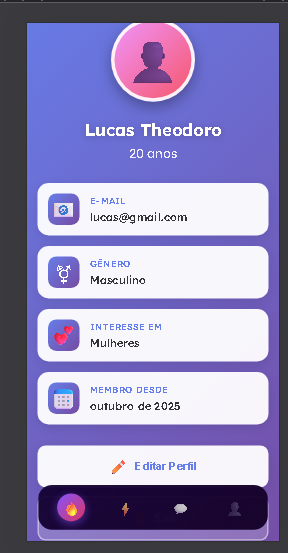

# 💕 Dating App - Aplicativo de Relacionamento

Um aplicativo de relacionamento moderno e completo, inspirado no Tinder, desenvolvido com tecnologias web modernas. Permite que usuários descubram pessoas, deem likes, façam matches e conversem em tempo real.


## 📋 Índice

- [Visão Geral](#-visão-geral)
- [Funcionalidades](#-funcionalidades)
- [Tecnologias](#-tecnologias)
- [Pré-requisitos](#-pré-requisitos)
- [Instalação](#-instalação)
- [Configuração](#-configuração)
- [Executando o Projeto](#-executando-o-projeto)
- [Estrutura do Projeto](#-estrutura-do-projeto)
- [API Endpoints](#-api-endpoints)
- [Banco de Dados](#-banco-de-dados)
- [Screenshots](#-screenshots)
- [Contribuindo](#-contribuindo)
- [Licença](#-licença)

## 🎯 Visão Geral

Este é um aplicativo de relacionamento full-stack que permite aos usuários:

- Criar perfis personalizados com fotos
- Descobrir novos perfis através de um sistema de swipe (estilo Tinder)
- Dar likes e dislikes em outros usuários
- Fazer matches quando há interesse mútuo
- Conversar com seus matches em tempo real
- Visualizar quem curtiu seu perfil
- Gerenciar suas preferências e informações pessoais

## ✨ Funcionalidades

### Autenticação e Perfil

- ✅ Cadastro de usuário com foto de perfil
- ✅ Login seguro com JWT
- ✅ Perfil personalizado com informações detalhadas
- ✅ Upload de fotos
- ✅ Visualização e edição de perfil

### Descoberta de Usuários

- ✅ Sistema de cards estilo Tinder
- ✅ Swipe para dar like (direita) ou dislike (esquerda)
- ✅ Filtros por preferência de gênero
- ✅ Cálculo automático de idade

### Sistema de Likes e Matches

- ✅ Like/Dislike em perfis
- ✅ Detecção automática de matches
- ✅ Modal de celebração ao dar match
- ✅ Visualizar quem curtiu você
- ✅ Visualizar quem você curtiu
- ✅ Badges com contadores de likes

### Mensagens e Chat

- ✅ Lista de conversas/matches
- ✅ Chat em tempo real (polling)
- ✅ Histórico de mensagens
- ✅ Indicadores de status online
- ✅ Contador de mensagens não lidas

## 🚀 Tecnologias

### Frontend

| Tecnologia                        | Versão | Descrição                |
| --------------------------------- | ------ | ------------------------ |
| **Angular**                       | 17.3.0 | Framework principal      |
| **TypeScript**                    | 5.4.2  | Linguagem de programação |
| **RxJS**                          | 7.8.0  | Programação reativa      |
| **SCSS**                          | -      | Pré-processador CSS      |
| **Angular Standalone Components** | -      | Arquitetura moderna      |

### Backend

| Tecnologia     | Versão      | Descrição                     |
| -------------- | ----------- | ----------------------------- |
| **Node.js**    | ≥18.0.0     | Runtime JavaScript            |
| **Express**    | 4.19.2      | Framework web                 |
| **TypeScript** | 5.4.5       | Linguagem de programação      |
| **Prisma ORM** | 5.14.0      | ORM moderno                   |
| **SQLite**     | -           | Banco de dados                |
| **JWT**        | 9.0.2       | Autenticação                  |
| **bcrypt**     | 5.1.1       | Hash de senhas                |
| **Multer**     | 1.4.5-lts.1 | Upload de arquivos            |
| **Zod**        | 3.23.8      | Validação de dados            |
| **Helmet**     | 7.1.0       | Segurança HTTP                |
| **CORS**       | 2.8.5       | Cross-Origin Resource Sharing |

### Ferramentas de Desenvolvimento

| Ferramenta | Descrição                                     |
| ---------- | --------------------------------------------- |
| **Biome**  | Linter e formatador (backend)                 |
| **ESLint** | Linter (frontend)                             |
| **tsx**    | TypeScript executor e Auto-reload do servidor |

## 📦 Pré-requisitos

Antes de começar, certifique-se de ter instalado:

- **Node.js** (versão 18 ou superior)
- **npm** (versão 9 ou superior)
- **Git**

Para verificar as versões instaladas:

```bash
node --version
npm --version
git --version
```

## 🔧 Instalação

### 1. Clone o repositório

```bash
git clone https://github.com/TheodoroL/dating-app.git
cd dating-app
```

### 2. Instale as dependências do Backend

```bash
cd backend
npm install
```

### 3. Instale as dependências do Frontend

```bash
cd ../frontend
npm install
```

## ⚙️ Configuração

### Backend

1. **Configure o arquivo de ambiente:**

Crie um arquivo `.env` na pasta `backend/`:

```env
# Banco de Dados
DATABASE_URL="file:./dev.db"

# JWT
JWT_SECRET="seu-secret-super-secreto-aqui"

# Servidor
PORT=8080
```

2. **Configure o banco de dados:**

```bash
cd backend
npx prisma generate
npx prisma migrate dev
```

Isso irá:

- Gerar o Prisma Client
- Criar o banco de dados SQLite
- Executar as migrações

### Frontend

O frontend não requer configuração adicional de ambiente, pois usa o arquivo `environment.development.ts` que já está configurado para apontar para `http://localhost:8080`.

Se necessário, você pode modificar:

**`frontend/src/environments/environment.development.ts`:**

```typescript
export const environment = {
  production: false,
  apiUrl: "http://localhost:8080",
};
```

## 🏃 Executando o Projeto

### Opção 1: Executar Backend e Frontend Separadamente

#### Backend (Terminal 1):

```bash
cd backend
npm run dev
```

O servidor backend estará disponível em: `http://localhost:8080`

#### Frontend (Terminal 2):

```bash
cd frontend
npm start
```

O aplicativo frontend estará disponível em: `http://localhost:4200`

### Opção 2: Executar em Produção

#### Backend:

```bash
cd backend
npm run build
npm start
```

#### Frontend:

```bash
cd frontend
npm run build
# Os arquivos compilados estarão em: frontend/dist/
```

## 📁 Estrutura do Projeto

```
dating-app/
├── backend/
│   ├── prisma/
│   │   ├── schema.prisma          # Schema do banco de dados
│   │   └── migrations/            # Migrações do banco
│   ├── src/
│   │   ├── controllers/           # Lógica de negócio
│   │   │   ├── auth.controller.ts
│   │   │   ├── user.controller.ts
│   │   │   ├── like.controller.ts
│   │   │   └── message.controller.ts
│   │   ├── middleware/            # Middlewares
│   │   │   ├── auth.middleware.ts
│   │   │   └── zod-validator.middleware.ts
│   │   ├── router/                # Rotas da API
│   │   │   ├── auth.route.ts
│   │   │   ├── user.route.ts
│   │   │   ├── like.route.ts
│   │   │   └── message.route.ts
│   │   ├── libs/                  # Bibliotecas e utilitários
│   │   │   ├── database/
│   │   │   ├── bcrypt/
│   │   │   └── schema/
│   │   └── index.ts               # Ponto de entrada
│   ├── uploads/                   # Arquivos enviados
│   ├── package.json
│   └── tsconfig.json
│
├── frontend/
│   ├── src/
│   │   ├── app/
│   │   │   ├── components/        # Componentes reutilizáveis
│   │   │   │   ├── bottom-nav/
│   │   │   │   ├── user-card/
│   │   │   │   ├── match-modal/
│   │   │   │   ├── input/
│   │   │   │   └── button/
│   │   │   ├── pages/             # Páginas da aplicação
│   │   │   │   ├── splash/
│   │   │   │   ├── login/
│   │   │   │   ├── profile-details/
│   │   │   │   ├── home/
│   │   │   │   ├── user-list/
│   │   │   │   ├── messages/
│   │   │   │   ├── conversation/
│   │   │   │   └── profile/
│   │   │   ├── services/          # Serviços
│   │   │   │   ├── auth.service.ts
│   │   │   │   ├── user.service.ts
│   │   │   │   ├── like.service.ts
│   │   │   │   └── message.service.ts
│   │   │   ├── guards/            # Guards de rota
│   │   │   │   ├── auth.guard.ts
│   │   │   │   └── guest.guard.ts
│   │   │   ├── interceptors/      # Interceptors HTTP
│   │   │   │   └── auth.interceptor.ts
│   │   │   ├── app.component.ts
│   │   │   ├── app.config.ts
│   │   │   └── app.routes.ts
│   │   ├── environments/          # Configurações de ambiente
│   │   ├── assets/                # Arquivos estáticos
│   │   ├── styles.scss            # Estilos globais
│   │   └── index.html
│   ├── angular.json
│   ├── package.json
│   └── tsconfig.json
│
└── README.md
```

## 🌐 API Endpoints

### Autenticação

| Método | Endpoint         | Descrição           | Auth |
| ------ | ---------------- | ------------------- | ---- |
| POST   | `/auth/register` | Cadastro de usuário | ❌   |
| POST   | `/auth/login`    | Login de usuário    | ❌   |

**Exemplo de Registro:**

```json
POST /auth/register
Content-Type: multipart/form-data

{
  "firstname": "João",
  "lastname": "Silva",
  "email": "joao@email.com",
  "password": "senha123",
  "dob": "1998-05-15",
  "gender": "MALE",
  "preference": "FEMALE",
  "photo": [arquivo]
}
```

### Usuários

| Método | Endpoint          | Descrição                      | Auth |
| ------ | ----------------- | ------------------------------ | ---- |
| GET    | `/users/me`       | Obter usuário atual            | ✅   |
| GET    | `/users/discover` | Listar usuários para descobrir | ✅   |
| GET    | `/users/matches`  | Listar matches                 | ✅   |

### Likes

| Método | Endpoint                 | Descrição              | Auth |
| ------ | ------------------------ | ---------------------- | ---- |
| POST   | `/likes/:userId`         | Dar like em usuário    | ✅   |
| POST   | `/likes/:userId/dislike` | Dar dislike em usuário | ✅   |
| GET    | `/likes/sent`            | Ver likes enviados     | ✅   |
| GET    | `/likes/received`        | Ver likes recebidos    | ✅   |

### Mensagens

| Método | Endpoint                     | Descrição        | Auth |
| ------ | ---------------------------- | ---------------- | ---- |
| GET    | `/matches/conversations`     | Listar conversas | ✅   |
| GET    | `/matches/:matchId/messages` | Obter mensagens  | ✅   |
| POST   | `/matches/:matchId/messages` | Enviar mensagem  | ✅   |

**Autenticação:**

```
Authorization: Bearer {token}
```

## 💾 Banco de Dados

### Modelo de Dados

O projeto utiliza SQLite com Prisma ORM. Principais entidades:

#### User

```prisma
model User {
  id          String   @id @default(uuid())
  firstname   String
  lastname    String
  email       String   @unique
  password    String
  gender      Gender
  preference  Gender
  dob         DateTime
  photos      Photo[]
  createdAt   DateTime @default(now())
  updatedAt   DateTime @updatedAt
}
```

#### Like

```prisma
model Like {
  id         Int      @id @default(autoincrement())
  fromUserId String
  toUserId   String
  isLike     Boolean  @default(true)
  createdAt  DateTime @default(now())

  @@unique([fromUserId, toUserId])
}
```

#### Match

```prisma
model Match {
  id        Int       @id @default(autoincrement())
  user1Id   String
  user2Id   String
  messages  Message[]
  createdAt DateTime  @default(now())

  @@unique([user1Id, user2Id])
}
```

#### Message

```prisma
model Message {
  id        Int      @id @default(autoincrement())
  senderId  String
  matchId   Int
  content   String
  createdAt DateTime @default(now())
  match     Match    @relation(fields: [matchId], references: [id])
}
```

### Comandos Úteis do Prisma

```bash
# Gerar Prisma Client
npx prisma generate

# Criar nova migração
npx prisma migrate dev --name nome_da_migracao

# Visualizar banco de dados
npx prisma studio

# Resetar banco de dados
npx prisma migrate reset
```

## 📸 Screenshots

### Tela Splash

Tela inicial com animações e branding do aplicativo.



### Tela de Login

Interface de autenticação com design moderno e gradientes.



### Tela de Cadastro

Formulário completo para criação de perfil com upload de foto.



### Home - Descoberta

Sistema de cards com swipe para dar like/dislike em perfis.

**Com perfis disponíveis:**



**Estado vazio:**



### Modal de Match

Celebração quando há match entre dois usuários.


### Lista de Usuários

Visualização em grid com tabs para todos os usuários, quem curtiu você e quem você curtiu.

**Tab: Todos os usuários (com pessoas)**


**Tab: Todos os usuários (vazio)**



**Tab: Curtiram Você**



**Tab: Você Curtiu**



### Chat - Conversas

Lista de matches e conversas ativas.


### Chat - Conversa Individual

Interface de mensagens em tempo real com histórico de conversas.



### Perfil do Usuário

Visualização completa do perfil do usuário com todas as informações.



## 🛠️ Scripts Disponíveis

### Backend

```bash
# Desenvolvimento com hot-reload
npm run dev

# Build para produção
npm run build

# Executar em produção
npm start

# Linting e formatação
npm run check
npm run check:write
```

### Frontend

```bash
# Desenvolvimento
npm start
# ou
ng serve

# Build para produção
npm run build
# ou
ng build

# Testes
npm test
# ou
ng test

# Linting
ng lint
```

## 🔐 Segurança

O projeto implementa várias medidas de segurança:

- ✅ **Senhas hasheadas** com bcrypt
- ✅ **JWT** para autenticação stateless
- ✅ **Helmet** para headers de segurança HTTP
- ✅ **CORS** configurado adequadamente
- ✅ **Validação de dados** com Zod
- ✅ **Guards de rota** no frontend
- ✅ **Interceptors** para adicionar token automaticamente
- ✅ **Sanitização** de inputs

## 🐛 Solução de Problemas

### Backend não inicia

```bash
# Verifique se as dependências estão instaladas
npm install

# Verifique se o Prisma está configurado
npx prisma generate
npx prisma migrate dev
```

### Frontend não conecta ao backend

1. Verifique se o backend está rodando na porta 8080
2. Confirme o `apiUrl` em `environment.development.ts`
3. Verifique erros de CORS no console do navegador

### Erro de autenticação

1. Certifique-se de que o JWT_SECRET está configurado no `.env`
2. Verifique se o token está sendo enviado corretamente
3. Limpe o localStorage e faça login novamente

### Imagens não carregam

1. Verifique se a pasta `backend/uploads/payload/` existe
2. Confirme as configurações do Helmet no backend
3. Verifique os headers CORS para recursos estáticos

## 📚 Recursos Adicionais

- [Documentação do Angular](https://angular.io/docs)
- [Documentação do Express](https://expressjs.com/)
- [Documentação do Prisma](https://www.prisma.io/docs)
- [Documentação do TypeScript](https://www.typescriptlang.org/docs/)

## 🤝 Contribuindo

Contribuições são bem-vindas! Para contribuir:

1. Fork o projeto
2. Crie uma branch para sua feature (`git checkout -b feature/MinhaFeature`)
3. Commit suas mudanças (`git commit -m 'Adiciona MinhaFeature'`)
4. Push para a branch (`git push origin feature/MinhaFeature`)
5. Abra um Pull Request

## 📝 Licença

Este projeto está sob a licença MIT. Veja o arquivo `LICENSE` para mais detalhes.

## 👥 Autores

- **Theodoro L** - [TheodoroL](https://github.com/TheodoroL)

## 🙏 Agradecimentos

- Inspirado no Tinder
- Comunidade Angular e Node.js
- Todos os contribuidores open-source

---

⭐ Se este projeto foi útil para você, considere dar uma estrela no GitHub!

**Made with ❤️ and TypeScript**
